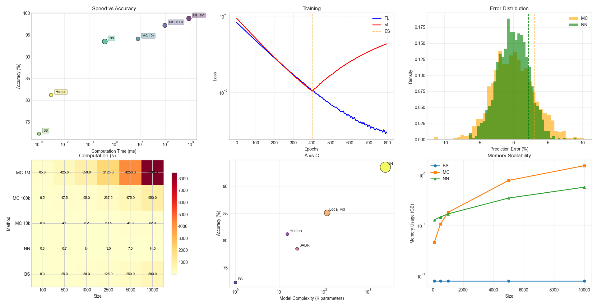
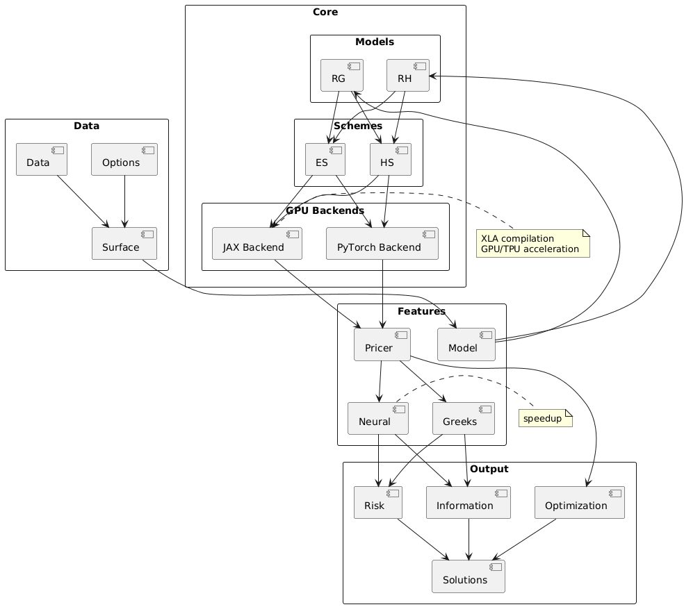

# Spetro

[](https://pypi.org/project/spetro/)
[](docs/thoughts.md)


[](docs/api.md)
[](https://pepy.tech/project/spetro)

Spetro implements rough volatility models for derivatives with accelerated  simulation and automatic differentiation.

## Frameworks

### Rough Bergomi Model
The rough Bergomi model extends classical stochastic volatility with fractional Brownian motion:

$$dS(t) = r S(t) dt + \sqrt{V(t)} S(t) dB(t)$$

$$V(t) = \xi \exp\left(\eta Y(t) - \frac{1}{2}\eta^2 t\right)$$

Where $Y(t)$ is fractional Brownian motion with Hurst parameter $H \in (0, 0.5)$ constructed via Riemann-Liouville kernel:

$$g(t) = \sqrt{\frac{2H \Gamma(3/2-H)}{\Gamma(H+1/2)}} t^{H-1/2}$$

### Rough Heston Model  
Fractional extension of Heston with mean-reverting volatility:

$$dS(t) = r S(t) dt + \sqrt{V(t)} S(t) dB(t)$$

$$dV(t) = \theta dt + \nu \sqrt{V(t)} dZ(t)$$

With correlation $\rho$ between $dB(t)$ and $dZ(t)$, and $V(0) = V_0$.


## Installation

```bash
pip install spetro
```

### Testing


### Architecture  


